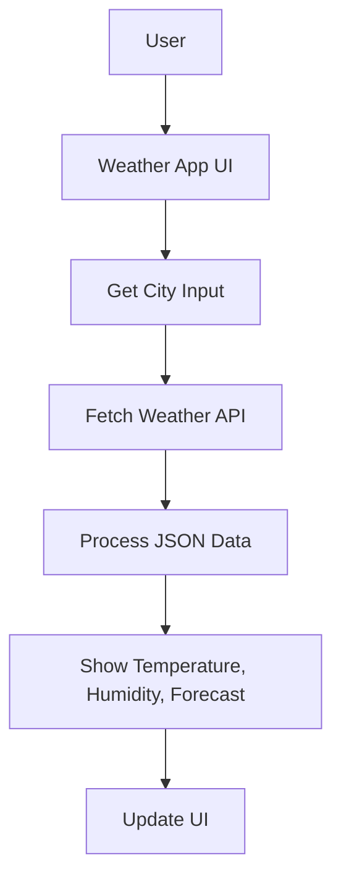

```mermaid
flowchart TD
    A[User] --> B[Weather App UI]
    B --> C[Get City Input]
    C --> D[Fetch Weather API]
    D --> E[Process JSON Data]
    E --> F[Show Temperature, Humidity, Forecast]
    F --> G[Update UI]
```
